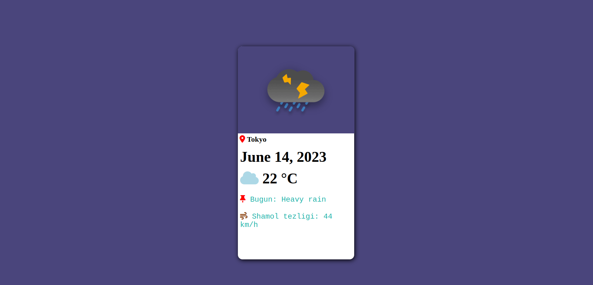
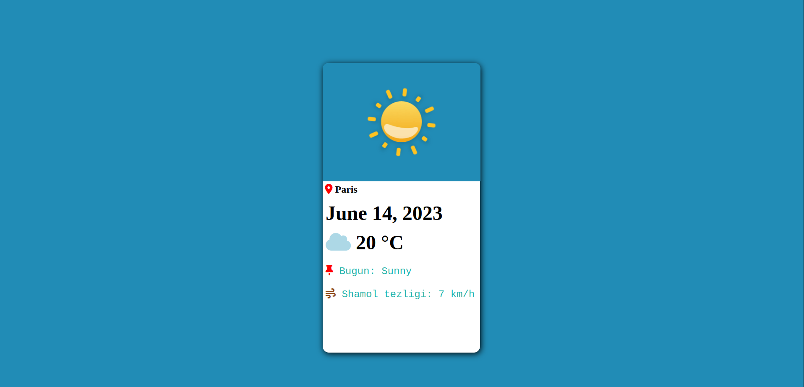
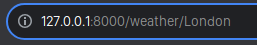

# Weather_App

## Приложение Погода

> Приложение Погода - это веб-приложение, созданное на основе Django, которое отображает информацию о погоде, используя API и отображает соответствующие изображения или гифки в зависимости от погодных условий. Это приложение предоставляет пользователям актуальные данные о погоде для разных городов.

**Пример программы так работает.**

## Установка
- Получение данных о погоде из API для получения текущей информации о погоде для конкретного города.
- Определение погодных условий (например, солнечно, облачно, дождливо) на основе ответа от API.
- Отображение изображений или гифок, связанных с погодными условиями.
- Отображение температуры, скорости ветра и описания погоды для выбранного города.
- Возможность пользователям искать информацию о погоде, вводя название города.

## Установка

**Для установки программы, выполните следующие шаги:**

1. Установите Python на вашу систему, если он еще не установлен. Вы можете скачать Python с официального сайта: https://www.python.org/downloads/

2. Клонируйте репозиторий с программой на вашу локальную машину:
 - **git clone** https://github.com/Humoyun004/Weather_App.git

3. Перейдите в директорию с программой:
cd Weather_App

## Использование

 **Запустите программу с помощью команды:**
 - **python manage.py runserver**.
 **Когда заходите в page home введите так dynamic rout http://127.0.0.1:8000/weather/ **Название города или государство.****

## Дополнительные ресурсы
- **Документация Django:** https://docs.djangoproject.com/

## Заключение
> Эта программа позволяет управлять 
погодом разных городовю

